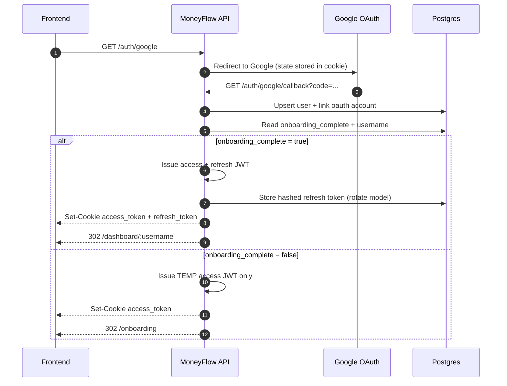
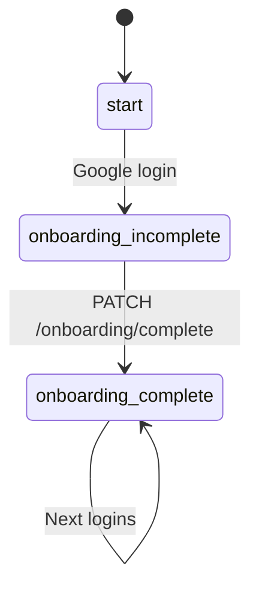

# MoneyFlow API (apps/server)

Production-ready NestJS backend for MoneyFlow:

- Google OAuth login
- Onboarding gate (`onboarding_complete`)
- JWT access + refresh tokens (delivered via httpOnly cookies)
- Avatar upload to Insforge Storage (S3-compatible)

Swagger is available at `/api` in non-production.

---

## 1) Project structure

Key folders:

- `src/main.ts` — bootstrap (helmet, CORS, validation, filters, interceptor, logging)
- `src/config/env.validation.ts` — env validation (Joi)
- `src/common/filters/http-exception.filter.ts` — consistent error response
- `src/common/interceptors/transform.interceptor.ts` — consistent success response
- `src/modules/auth/*` — Google OAuth + JWT + refresh rotation
- `src/modules/onboarding/*` — onboarding completion + username checks
- `src/modules/uploads/*` — `POST /uploads/avatar` (JWT required)
- `src/modules/dashboard/*` — dashboard (JWT + onboarding + username ownership)
- `src/modules/users/*` — user profile endpoints
- `prisma/schema.prisma` — Postgres schema

Response format:

```json
{
  "success": true,
  "data": { "...": "..." }
}
```

Errors:

```json
{
  "success": false,
  "error": {
    "code": "BAD_REQUEST",
    "message": "Validation failed",
    "details": []
  }
}
```

---

## 2) Auth flow diagram (Google OAuth → onboarding gate)

Important:

- Tokens are **never** returned in query params.
- `refresh_token` is only issued when `onboarding_complete = true`.
- Both tokens are set as httpOnly cookies: `access_token`, `refresh_token`.



---

## 3) Onboarding state machine

`username` is intentionally nullable in DB. It becomes required at onboarding completion.



`PATCH /onboarding/complete` (JWT required):

- Multipart `avatar` upload (jpg/png/webp/gif)
- Validates: username format + uniqueness, age range, file size + magic bytes
- Uploads avatar to Insforge Storage
- Sets `onboarding_complete=true`, `onboarding_step=complete`
- Issues full tokens (access + refresh) as cookies

---

## 4) DB design & indexing (Prisma + PostgreSQL)

Schema lives in `prisma/schema.prisma`.

Models:

- `User`
  - `email` unique
  - `username` unique (nullable until onboarding complete)
  - `onboarding_complete`, `onboarding_step`
- `OauthAccount`
  - unique composite: `(provider, provider_account_id)`
  - indexed: `user_id`
- `RefreshToken`
  - `id` is JWT `jti`
  - stores **hashed** refresh token + expiry
  - indexed: `user_id`, `expires_at`
- `AuditLog`
  - stores auth/onboarding/upload audit events
  - indexed: `user_id`, `created_at`

---

## 5) Security layers

- **Helmet** for secure HTTP headers
- **CORS whitelist** + `credentials: true` for cookie-based auth
- **JWT auth** (`Authorization: Bearer ...` or `access_token` cookie)
- **OnboardingGuard** to block protected features until onboarding complete
- **Refresh rotation** (hashed refresh token stored in DB, reuse invalidates all tokens)
- **Throttling** via `@nestjs/throttler` (global + tighter on `/auth/refresh`)
- **Upload hardening**: size limit + allowed mime list + magic-byte detection
- **Logging**: `pino-http` with redaction for `authorization` and `cookie` headers

---

## 6) Insforge Storage setup (S3-compatible)

Avatar uploads use the AWS S3 SDK pointed at Insforge endpoints.

Required env vars:

- `INSFORGE_S3_ENDPOINT`
- `INSFORGE_S3_REGION`
- `INSFORGE_S3_ACCESS_KEY_ID`
- `INSFORGE_S3_SECRET_ACCESS_KEY`
- `INSFORGE_S3_BUCKET_AVATARS`
- `INSFORGE_PUBLIC_STORAGE_URL`

The API returns a public URL like:

`INSFORGE_PUBLIC_STORAGE_URL/<bucket>/<objectKey>`

---

## 7) Optimizations

- Avoids redundant DB calls in guards by using `req.user` from JWT strategy
- Stores refresh tokens hashed (bcrypt) + rotates on each refresh
- Uses Prisma `select` to fetch only needed fields
- Upload uses memory storage only to validate magic bytes, then uploads directly to S3

---

## 8) Migrations & Prisma commands

Commands (see `package.json` scripts):

```bash
npm run prisma:generate
npm run prisma:migrate
npm run prisma:deploy
npm run prisma:studio
```

---

## 9) Running locally

Prereqs:

- Node.js (LTS recommended)
- PostgreSQL database
- Google OAuth credentials (Client ID/Secret + callback URL)

Steps:

```bash
cd apps/server
cp .env.example .env
npm install
npm run prisma:generate
npm run prisma:migrate
npm run start:dev
```

Swagger (non-prod): `http://localhost:<PORT>/api`
Health: `GET /health`

---

## 10) Deployment notes

Build + start:

```bash
cd apps/server
npm ci
npm run prisma:deploy
npm run build
npm start
```

Cookie + CORS requirements:

- `NODE_ENV=production` enables `Secure` cookies — serve over HTTPS.
- Set `CORS_ORIGINS` to a comma-separated list of allowed frontend origins (must include scheme).
- Ensure the API and frontend domains are configured to allow cookie auth (SameSite=Lax).

Environment variables (minimum):

- `DATABASE_URL`
- `FRONTEND_URL`
- `APP_URL`
- `GOOGLE_CLIENT_ID`, `GOOGLE_CLIENT_SECRET`, `GOOGLE_CALLBACK_URL`
- `JWT_ACCESS_SECRET`, `JWT_REFRESH_SECRET`
- Insforge S3 vars (see section 6)
- `CORS_ORIGINS`
